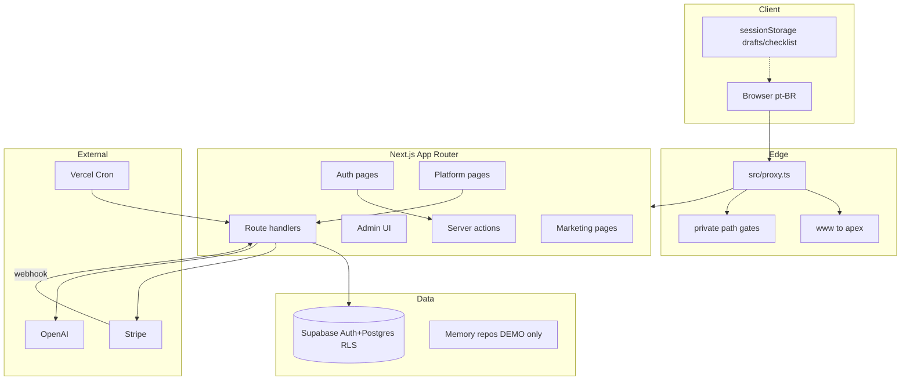
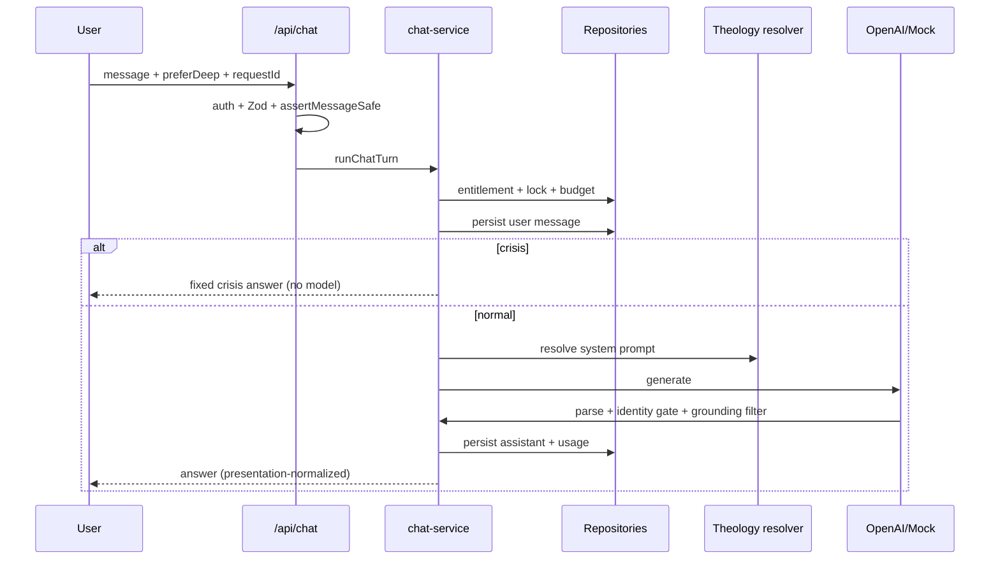
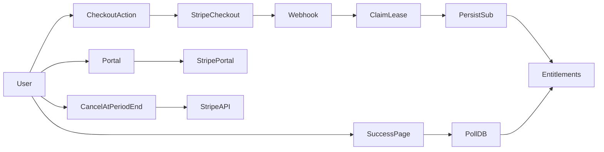

# Amém Chat — Architecture, Data Flows and Trust Boundaries

**Data:** 2026-07-21
**Tip auditado na entrada:** `358142e`
**Tip de produto validado:** `c03ff10`
**Escopo:** mapa arquitetural verificável (código + docs). Sem remoto.

---

## 1. Visão de componentes

---

## 2. Entrada edge e auth

| Peça | Papel | Arquivo |
|------|-------|---------|
| Proxy | Substitui middleware clássico | `src/proxy.ts` |
| Canonical host | www → apex 308 | `src/lib/edge/canonical-host.ts` |
| Private paths | HTML privado exige sessão | `src/lib/edge/private-paths.ts` |
| Session cookies | `SameSite=lax`; Domain `.amemchat.com.br` só em Vercel Production | `src/lib/supabase/auth-cookie-options.ts:18-25` |
| Auth callbacks | PKCE / confirm | `src/app/auth/callback`, `confirm` |
| safeNextPath | Anti open-redirect | `src/lib/navigation/safe-next-path.ts` |

**Trust boundary A:** browser não autenticado ↔ páginas públicas.
**Trust boundary B:** sessão Supabase ↔ rotas `PRIVATE_*`.
**Trust boundary C:** `isAdmin` / `admin_roles` ↔ `/admin` e APIs admin.
**Trust boundary D:** service role / secret key ↔ apenas server-only após asserts admin ou paths trustados.

---

## 3. Rotas e APIs (resumo)

Ver ledger completo em `AMEM_AUDIT_COVERAGE_LEDGER_2026-07-21.md`.

Fluxos críticos:

| Fluxo | Entrada | Persistência | Saída |
|-------|---------|--------------|-------|
| Chat | `POST /api/chat` | conversations/messages/usage | JSON answer + requestId |
| Jornadas | pages + `/api/journeys/progress/*` | `journey_progress` | progresso / complete |
| Checkout | `startCheckoutAction` | Stripe + signup intents | redirect Checkout |
| Webhook | `POST /api/webhooks/stripe` | subscriptions / payment_events | 200/409 |
| Export | `GET /api/account/export` | leitura user-scoped | JSON/CSV |
| Cron | `GET /api/cron/daily-report` | daily reports | e-mail/ops |

---

## 4. Fluxo de dados — Chat / IA

Pontos de confiança:

1. Cliente não escolhe persona/modelo livremente além do autorizado.
2. Crisis short-circuit antes do provider (`chat-service.ts` ~347–409).
3. Grounding filtra refs; texto livre da resposta **não** é reescrito por corpus.
4. Logs usam redaction (`logging/mask.ts`) — conteúdo espiritual não deve ir a logs.
5. Lock de turno é **process-local** (`chat-turn-lock.ts:1-7`).

---

## 5. Fluxo de dados — Billing

Separação test/live: `key-mode.ts` rejeita evento `livemode` incompatível com prefixo da chave.
Receita admin: estimativa de catálogo; `realRevenueBrlCents: null` até integração Stripe cash.

---

## 6. Fluxo de dados — Jornadas

- Catálogo em código (`src/lib/journeys/journeys/*`) — 3×7 = 21 etapas.
- Prefill → composer (sem injeção no system prompt).
- Progresso: IDs de etapa em `journey_progress` (sem reflexões pessoais) — `READING_JOURNEYS_PERSISTENCE.md`.
- Conclusão agregada: celebração só com `isCompleted` / `completedAt` (`c03ff10`).

---

## 7. Admin e logs

| Superfície | Dados | Risco |
|------------|-------|-------|
| Usuários / métricas | e-mail, plano, uso, custos agregados | PII operacional |
| Aquisição | UTM first/last | marketing |
| Relatório diário | agregados | sem conteúdo de chat |
| Alertas | past_due, checkout stuck, custos | ops |

Admin exige `requireAdminUser`. Service role só após `assertAdminServiceAccess`.
**Ausente:** trilha de auditoria de ações admin.

---

## 8. Inventário de dados (alto nível)

| Dado | Onde | Retenção |
|------|------|----------|
| Auth identity / e-mail | Supabase Auth | enquanto conta |
| Profile / plan | Postgres | enquanto conta |
| Mensagens | Postgres | enquanto conta (sem purge automatizado) |
| Drafts | sessionStorage | sessão / clear logout |
| Checklist ativação | sessionStorage | sessão |
| Journey progress | Postgres IDs | enquanto conta |
| Consents versionados | `legal_consents` | histórico |
| UTM cookies | 1P cookies | conforme capture |
| Usage / costs | usage_events | ledger |
| Stripe customer/sub | Stripe + espelho local | ciclo billing |
| Logs | Vercel/runtime | política plataforma (não documentada RTO) |

---

## 9. Trust boundaries — resumo

| Boundary | Controle | Residual |
|----------|----------|----------|
| HTML privado | proxy session gate | smoke auth remoto |
| API user | `getSessionUser` + userId filters | RLS 004 não aplicada |
| API admin | `requireAdminUser` | MFA ausente |
| Webhook | Stripe signature + mode | smoke live |
| Cron | `CRON_SECRET` timing-safe | secret ops |
| AI | entitlement + crisis + identity parse | alucinação em texto livre |
| Demo | `allowsMocks()` false em prod | DEMO_MODE em preview |

---

## 10. Diagramas de deployment (esperado)

Ambientes documentados: local, Vercel preview, Vercel production.
**Não há** staging dedicado com runbook próprio.
Cutover: `PRODUCTION_CUTOVER_RUNBOOK.md` (deploy SHA + envs; DB apply separado e humano).
